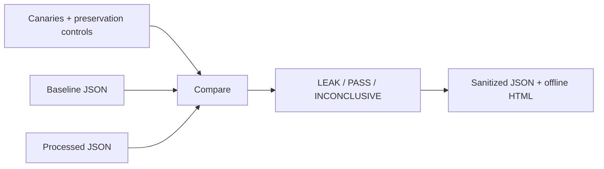

# Design and threat model

## Contract

`compare(before, after, manifest)` is a deterministic, non-mutating Python API. The CLI loads bounded strict JSON. A known match in the output always wins over an inconclusive baseline: missing evidence must never conceal a leak.

## Trust boundaries

All input values and keys are untrusted. Detection operates on decoded strings. Reports emit public manifest labels, encoding names and ordinal positions rather than raw values, raw keys or hashes of matches. Canary labels are public identifiers: do not put a secret in a label. Error messages omit filenames and offending data. HTML escapes report content and its CSP permits only the exact embedded stylesheet hash.

Strict comparison of preservation controls prevents Python's `True == 1` equivalence from producing a false control pass. Duplicate keys and JSON non-finite numbers are rejected. Numeric-only canaries are intentionally unsupported because parsing could change their lexical representation.

## Trade-offs

Known canaries make findings reproducible but do not discover unknown sensitive data. Ordinal paths protect report privacy but are less convenient than raw JSON paths. SHA-256 matching demonstrates a stable known identifier; it does not claim to reverse hashes. Exact encoding variants are bounded and documented, not exhaustive normalization.

## Production integration not included

Feed synthetic records through your real collector/filter, preserve the baseline and output exports, then run `compare`. Define meaningful preservation controls for trace identity, event count or service identity in your fixture. This release has no remote exporter, no Collector container and no certification claim.
